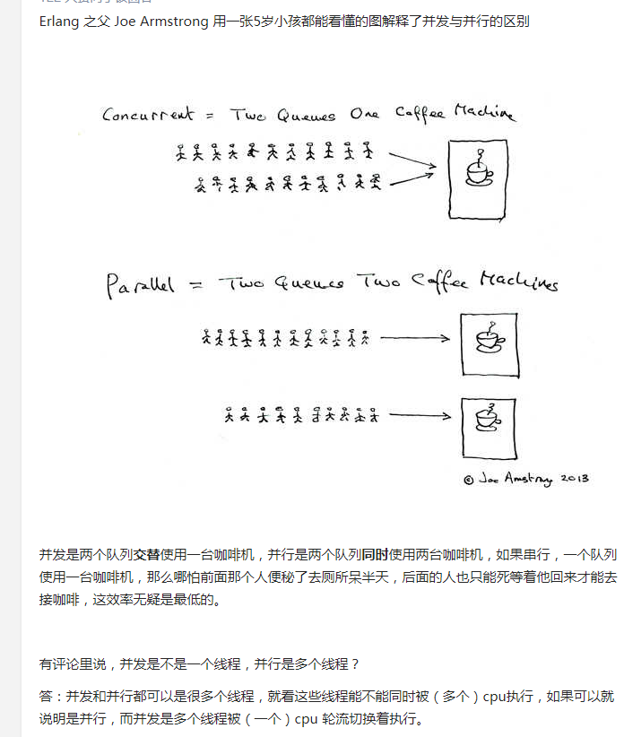

Java多线程和内存模型（一）
===
由于java是运行在 JVM上 的，所以需要涉及到 JVM 的内存模型概念，需要理解内存模型，就需要多线程的基础；
而线程是基于载体线程里的，所以我们借由操作系统的进程来讲一讲。

 进程
---
#### 什么是进程？
+ 进程是程序的运行实例
+ 进程是一个程序及其数据在处理机上顺序执行时所发生的活动
+ 进程本身不是基本运行单位，而是线程的容器
+ 但进程是系统进行资源分配和调度的一个单位
+ 进程需要一些资源才能完成工作，如CPU使用时间、内存、文件以及I/O设备，且为依序逐一进行，也就是每个CPU核心任何时间内仅能运行一项进程。
+ 我们常说的进程实体就是**PCB块（Process Control Block）**；
#### 什么是PCB（进程控制块）？
**进程控制块(PCB)**是系统为了管理进程设置的一个**专门的数据结构**。 系统用它来**记录进程的外部特征，描述进程的运动变化过程**。 同时，系统可以利用PCB来控制和管理进程；

**PCB（进程控制块）是系统感知进程存在的唯一标志。**

通常我们编写的程序是静止的东西，是不能并发执行的个体，为了使程序（包含数据）能独立运行，便出现了为程序配备PCB（进程控制块）的概念；
**由程序段，相关数据段和PCB三部分构成了进程实体**

#### 进程的特征
#####1.动态性
进程拥有自己的生命周期，它由创建而产生，由调度而执行，由撤销而消亡；
容易模糊的概念：**程序是不是一个进程？**
+   程序本身只是指令、数据及其组织形式的描述，并且存放在某种储存介质上，属于静态的
+  进程才是程序（那些指令和数据）的真正运行实例。
#####2.并发性
多个进程实例在同一时间间隔内一起运行，宏观上就好像多个进程同时在工作；
**实际上却是一种CPU多核处理临界资源的机制**
易混点：**并发和并行**
[Erlang 之父 Joe Armstrong 用一张5岁小孩都能看懂的图解释了并发与并行的区别](https://www.zhihu.com/question/33515481)

#####3.异步性
进程是按照异步方式运行的，即按各自独立的，不可预知的速度向前推进。若参与并发执行，产生的结果会出现不可再现性。如果需要保持其结果是可再现的，需要配合相应的进程同步机制进行控制。
#####4.独立性
在传统的OS中，进程实体是一个能独立运行的，独立获得资源和独立接受调度的基本单位；凡未建立PCB的程序都不能作为一个独立的单位参与运行。

#### 进程的三种基本状态
**1.就绪态（Ready）**
该状态的进程已分配除CPU以外的所有必要资源后，只需要获得CPU，便可立即执行。
所以就绪的前提是运行所需的资源分配完全。
 
**2.执行态（Running）**
进程已获得CPU，其程序正在执行。在单处理机系统中，只有一个进程处于执行状态； 在多处理机系统中，则有多个进程处于执行状态。

**3.阻塞态（Block）**
正在执行的进程由于发生某事件而暂时无法继续执行时，便放弃处理机而处于暂停状态，亦即进程的执行受到阻塞，把这种暂停状态称为阻塞状态，有时也称为等待状态或封锁状态。
**导致进程阻塞的典型事件：**
+ I/O请求
+ 申请缓冲区
+ 等待信件（信号）等
**通常将这种处于阻塞状态的进程也排成一个队列。有的系统则根据阻塞原因的不同而把处于阻塞状态的进程排成多个队列。**

现在的操作系统中的进程除了以上的三种基本状态，还多了一种 **”挂起状态“**

**什么是挂起状态？**
进程在操作系统中可以定义为暂时被淘汰出内存的进程，机器的资源是有限的，在资源不足的情况下，操作系统对在内存中的程序进行合理的安排，其中有的进程被暂时调离出内存，当条件允许的时候，会被操作系统再次调回内存，重新进入等待被执行的状态即就绪态，系统在超过一定的时间没有任何动作。
挂起在操作系统中用原语表示为：**Suspend** ；相应的激活原语为：**Active**。

**挂起和阻塞的区别：**
挂起为主动挂起，阻塞是被动阻塞；

**挂起产生的五个原因：**
1.交换（负荷调节需求）：
操作系统需要释放足够的内存空间，以调入并执行处于就绪状态的进程。

2.其他OS原因：
操作系统可能挂起后台进程或工具程序进程，或者被怀疑导致问题的进程。

3.交互式用户请求：
用户可能希望挂起一个程序的执行，目的是为了调试（debug）或与一个资源的使用进行连接。

4.定时：
一个进程可能会周期性地执行（例如记账或系统监视进程），而且可能再等待下一个时间间隔时被挂起。

5.父进程请求：
父进程可能会希望挂起后代进程的执行，以检查或修改挂起的进程，或者协调不同后代进程之间的行为。

**加入挂起后的进程状态转换图：**
 

**静止阻塞的时候，要是当时被阻塞的进程的需求者来到，那么它就会被释放到静止就绪状态；但是没有获得Active() 激活状态下，它依旧没办法进入活动就绪队列，也就没有办法得到执行**

#### 进程既然具有生命周期，必然存在创建和终止的状态
**1.创建状态：**
+ 申请空的PCB
+ 向PCB中写入控制和管理进程的信息
+ 分配运行时该进程所需要的资源
+ 把该进程装入就绪状态并插入就绪队列中

**2.终止状态**
+ 由操作系统进行终止进程的善后工作（主要是保存状态码和一些计时统计数据）
+ 善后工作完成后，将PCB清0，并把PCB所占空间返回给系统

**创建进程的实质：创建进程实体中的PCB**
**撤销进程的实质：撤销进程的PCB**

 #### 需要注意的经典进程同步问题
**1.生产者--消费者问题**
[维基百科——生产者--消费者问题](https://zh.wikipedia.org/wiki/%E7%94%9F%E4%BA%A7%E8%80%85%E6%B6%88%E8%B4%B9%E8%80%85%E9%97%AE%E9%A2%98)
[C语言——生产者--消费者问题](http://c.biancheng.net/cpp/html/2600.html)
**2.哲学家进餐问题**
[C语言——哲学家进餐问题](http://c.biancheng.net/cpp/html/2602.html)
**3.读者--写者问题**
[C语言——.读者--写者问题](http://c.biancheng.net/cpp/html/2601.html)

线程
---
#### 什么是线程?
线程是操作系统能够进行**运算调度的最小单位**；它被包含在进程中，是进程中的**实际运作单位。**
一条线程指的是进程中一个**单一顺序的控制流**，一个进程中可以并发多个线程，每条线程并行执行不同的任务。在Unix System V 及 SunOS 中也被称为轻量进程（lightweight processes），但是轻量进程更多指内核线程（kernel thread），把用户线程（user thread） 称为线程。

#### 线程与进程的关系
+ **同一个进程**中的**多条线程将共享**该进程中的**全部系统资源**，如虚拟地址空间，文件描述符号 和 信号处理等；
+ 同一进程中的多个线程有各自的**调用栈，寄存器环境，线程本地储存**；
+ 区别：
	+	**调度层面：**
	+	在引入线程的操作系统中，把线程作为调度和分派的基本单位，而进程作为资源拥有的基本单位；
	+	在同一个进程中，线程的切换不会引起进程的切换；
	+	从一个进程中的线程切换到另一个进程中的线程时，会引起进程的切换；
	+	**并发性层面：**
	+	 进程之间在并发执行的同时，进程内的若干线程也可以并发执行；
	+	 **拥有资源：**
	+	 进程拥有资源；线程不拥有资源，共享所属进程的资源；
	+	 **系统开销：**
	+	 进程在被创建和撤销时，创建和回收PCB，分配和回收资源，系统的开销明显高与线程；
	+	 进程切换时，CPU环境的保护以及新被调度的进程CPU环境的配置；而线程的切换仅需要保存和设计少量寄存器内容；
	+	 通信方面，一个进程中的所有线程具有相同的地址空间，在同步和通信的实现方面线程也比进程容易；

Java中的线程
---
#### 生命周期
java线程在运行的生命周期会有6种：

| 状态名称	|说明 	|
| :-------- | :--------|
| NEW（new）	|   初始状态，线程被构建，但是还没有调用Star()方法|
| RUNNABLE（runnable）	|  运行状态，Java线程将操作系统中的就绪（Ready）和运行(Runing)两种状态笼统的称为“运行中” |
| BLOCKED（blocked）|   阻塞状态，表示线程阻塞于锁|
| WAITING（waiting）|   等待状态，表示线程进入等待状态，进入该状态表示当前线程需要等待其他线程做出一些特定的动作（通知或者中断）|
| TIME_WAITING（time_waiting）|   超时等待状态，该状态不用与WAITING混淆，它是可以在指定的时间自行返回的|
| TREMINATED（treminated）|   终止状态，表示当前线程已经执行完毕|

#### Java线程生命周期流程图

     

